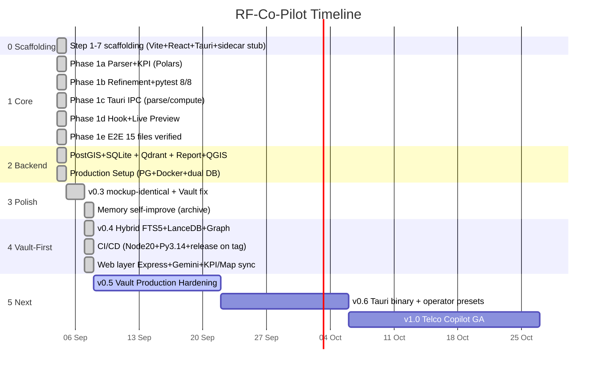

# 🗺️ RF-Co-Pilot Roadmap — 0 → Sekarang → v1.0

> **Repo:** [mezzonuts/RF-Co-Pilot](https://github.com/mezzonuts/RF-Co-Pilot) · **Project:** [@mezzonuts's RF-Co-Pilot-Project](https://github.com/users/mezzonuts/projects/5) · **Default branch:** `feat/v0.4-vault-grounded-loop` · **Latest:** `v0.4.0` + `5c8a906` (2026-09-08 Skill-Aware)
>
> Dokumen ini adalah **single source of truth** roadmap. Update via PR ke file ini + sinkron ke GitHub Project (Issues). Bahasa: Indonesia (istilah RF/engineering tetap EN).

---

## 1) Vision

**RF-Co-Pilot = TelecomAgent** — AI copilot untuk RF engineer 4G/5G yang:

1. **Grounded** — jawaban selalu berdasar Vault (3GPP 38.211/38.331 + vendor Ericsson/Huawei playbook + SOP operator), bukan halusinasi LLM.
2. **Actionable** — dari raw Drive Test log → KPI → RCA → rekomendasi tilt/PCI/neighbor → export Excel/PPT siap kirim ke operator.
3. **Vault-First** — Obsidian `wiki/atomic/` = Single Source of Truth (Karpathy LLM Wiki). Semua query lewat Hybrid Retrieval sebelum panggil LLM.
4. **NPM-only dev** — `npm install && npm run build && python http_server.py` → jalan di `http://localhost:8000` tanpa wajib Rust/Docker/PostgreSQL.

---

## 2) Timeline Visual



---

## 3) Fase Detail — Dari 0 Sampai Sekarang

### Phase 0 — Scaffolding (2026-09-04) ✅ `94c64a3` / `d1a0c8a`
**Tujuan:** pondasi Tauri+React+TS+Python jalan `npm run build` tanpa error.
- `npm init`, `vite.config.ts` port 5173, `tsconfig.json`, `index.html`
- `src-tauri/Cargo.toml`, `tauri.conf.json` 1200×800, `src/main.rs` minimal (tanpa butuh Rust terinstall)
- Copy `telecom_agent_ui.html` → `src/components/`, rewrite `App.tsx` 4 tab + LLM modal (inline style)
- `src-tauri/python/telecom_agent/{parsers,kpi,database}.py` stub + `requirements.txt`
- `README.md`, `docs/dev-guide.md`, `.gitignore`, `git init`
- Verifikasi: `npm run build` 30 modules → 166kB gzip 51kB
- Logs: `logs/coding/00-FINAL-SUMMARY.md`, `report-1-init.md` s/d `report-7-verifikasi.md`, `LOG-INDEX.md`

### Phase 1 — Core Engine (2026-09-04) ✅ `e757c4d`
| Sub-phase | Deliverable | Status |
|-----------|-------------|--------|
| **1a** `report-phase-1a-parser-kpi.md` | `parsers.py` + `kpi.py` Polars — parse DT generic/Tems/Nemo, hitung RSRP/SINR/Throughput | ✅ |
| **1b** `report-phase-1b-refinement.md` + `review-phase-1a-code.md` | Refactor `argparse`/`logging`, 8 pytest 100% pass | ✅ |
| **1c** `report-phase-1c-ipc.md` | `commands.rs` → `parse_dt_file`, `compute_kpi`, `health_check` Tauri IPC | ✅ |
| **1d** `report-phase-1d-frontend.md` | `useParserCommand.ts` hook + Live Preview panel integration | ✅ |
| **1e** `report-phase-1e-e2e.md` | E2E 15+ files, 8/8 tests, Phase 1 complete | ✅ |
| **Fix** `c5ff65b` | gitignore, reqs, TS import, union guards, KPI validation | ✅ |

### Phase 2 — Backend Extensions (2026-09-04) ✅
| Commit | Fitur | Test |
|--------|-------|------|
| `6f8d44a` | QGIS export utils + tests | ✅ |
| `1d6b2d2` | PostGIS schema + SQLite fallback — `Cell Master` & `DT Logs` CRUD | ✅ |
| `a24a45e` | Qdrant Lite fallback — KPI & coverage vector search | ✅ |
| `be5f6f8` | PDF & Excel reporting engine (KPI summaries) | ✅ |
| `19c6bdc` | Phase 3 Production — PostgreSQL `docker-compose.yml` + dual DB (PG/SQLite) | ✅ |

### v0.3 — AgentWorkspace Polish (2026-09-05 → 2026-09-07) ✅
- `c02fc73` README + `bin/rf-copilot` CLI (NPM-only install)
- `2501d12` `INSTALL-GUIDE.md` untuk user non-IT
- `ad05f93` **AgentWorkspace mockup-identical** (pixel-perfect `telecom_agent_ui.html`), Vault blank fix, Tailwind CDN, install guide update
- `4bd6390` `[verified]` **Memory self-improve** — `archiveCurrent()` → project memory + user profile, `New Analysis` reset, footer 7px `#52525b`
- `6ed96ed` v0.3 final commit before v0.4

### v0.4 — Vault-First Grounded Loop (2026-09-07) ✅ `316574d` — Current Default
**Paradigma:** Karpathy LLM Wiki — `raw/ immutable → wiki/atomic/ (1 note=1 konsep+YAML) + wiki/synthesis/ + index.md/log.md`

| Layer | File | Fungsi |
|-------|------|--------|
| `sidecar/vault_engine/parser.py` | 30 lines | Parse markdown → `VaultNote` + frontmatter |
| `graph.py` | 62 lines | NetworkX DiGraph wikilinks `[[...]]`, 1-hop expand |
| `indexer.py` | 130 lines | SQLite FTS5 + LanceDB+FastEmbed (fallback no-op) |
| `retriever.py` | 201 lines | Hybrid RRF: BM25 + vector + graph rank fusion |
| `sidecar/agent/sufficiency_gate.py` | 122 lines | `check_sufficiency()` — definisional `apa itu RSRP` → Mode B, butuh file → tanya balik |
| `prompt_builder.py` | 110 lines | Grounded Context Injector + JSON Schema Enforcer |
| `router_client.py` | 87 lines | `_get_9router_key()` dari `AppData/Roaming/9router/db/data.sqlite` + fallback `my-combo/gpt-5.x` |
| `self_improvement.py` | 123 lines | Gap → `wiki/log.md` + `raw/drafts/` Human-in-the-Loop |
| `parsers/excel.py` 73 + `csv_parser.py` 37 | multi-sheet 15 sheets, deteksi Raw Power Query | |
| `export/excel.py` 89 + `pptx.py` 122 | openpyxl/pptxgen 5 slides | |
| `http_server.py` wired | `SIDECAR_V04`, `/api/chat` hybrid+gate+self_improvement, `/api/parse`, `/api/vault/*`, `/api/export/*` | |
- Architecture: `rf-copilot-v0.4-architecture.html` 201 lines + `ARCHITECTURE_v0.4.md` 52 lines (v0.3 lama dipertahankan)
- Vault: `C:/Users/PC/Documents/Obsidian/Dika/wiki` — 25 atomic files, graph 85 nodes/76 edges, `GET /api/vault/stats` live `vault_cached:34`
- Release: `v0.4.0` tag `16019f4` — `rf-copilot-v0.4.0.zip` 109KB · https://github.com/mezzonuts/RF-Co-Pilot/releases/tag/v0.4.0

### CI/CD (2026-09-07) ✅ `16019f4`
`.github/workflows/ci-cd.yml` 196 lines — NPM-only (tanpa Rust/Docker):
- `build-frontend` Node 20: `npm ci → tsc --noEmit → vite build → verify dist → artifact 14 hari`
- `verify-python` Py 3.14: `compileall + Vault smoke (2 dummy notes [[SINR]] → hybrid → gate → parsers/export) → pytest → ruff`
- `release` on `v*.*.*`: zip `dist+sidecar+docs` → `softprops/action-gh-release`
- Unified `requirements.txt` 22 lines (`openpyxl`, `python-pptx`, `pyyaml`, `networkx` wajib + `lancedb/fastembed` opsional)

### Web Layer — Express + Gemini + Dynamic Preview (2026-09-07) ✅ `90d99fd` → `aeb8f9f`
| File | Lines | Apa |
|------|-------|-----|
| `server.ts` | 956 | Express + Vite middleware, `/api/chat` **Gemini live** (`@google/genai` + fallback RF domain engine), `/api/parse` ExcelJS multi-sheet, `/api/export` live-synced, `/api/vault` in-memory, `/api/memory` |
| `LivePreviewPanel.tsx` | 1471 | `computedMetrics` dinamis dari `localRows` (RSRP/SINR/Tput + distribusi Exc/Good/Fair/Poor + worst 5 + HOSR), `mapSamples`/`cellTowers` centroid, inline cell edit + formula bar, sheet tabs |
| `EsriLiveMap.tsx` | 651 | Leaflet sectors/samples/worstSpots + centroid overlay |
| `RfToolDrawer.tsx` | 565 | RF tools drawer + export triggers |
| `App.tsx` | 247 Δ | `provider google/gemini-2.5-flash` default, `apiKey useState('')` sanitized, `9router ''`, `fetch /api/chat` verification, skill create → `vault/ingest` |
| `AgentWorkspace.tsx` | 502 Δ | `LivePreviewPanel` import, hapus `hasStarted` overlay, `skillPrompts`, `archiveCurrent` simpan `parsedRows/sheetsData`, export POST `customData` |
| `hooks/*` | 64+66 Δ | `isTauri` guard + fetch fallback |
| `package.json` | | `dev: tsx server.ts`, `build: vite+esbuild server.cjs`, deps `leaflet/exceljs/pptxgenjs/express/@google/genai` |
| `index.html` | | meta `og:title/description` |
| `.env.example` | | `GEMINI_API_KEY=[REDACTED]` |
| `.gitignore` | | `+.env/.env.local`, `bun.lock`, `*.zip`, `release_notes_*.md`, `.DS_Store` |

- Security: `+` lines scan **0** hardcoded secrets (`AQ.Ab8` sanitized → `''` + `[REDACTED]`), `gho_/sk-` 0
- Build: `tsc 0`, `vite 433KB gzip 124KB`, `py compile 0` — baseline stash juga 0 → no regression


### Skill-Aware — 22+6 Default Skills + Summarize-before-LLM (2026-09-08) ✅ `5c8a906`
| Layer | Detail |
|-------|--------|
| **Source** | `C:/Users/PC/Documents/Skill AI` (22 — xlsx/polars/pdf/pptx/docx/dask/geopandas/networkx/aeon/timesfm/matplotlib/seaborn/…) = external primary · `./skills/` bundled fallback (portable) · 6 builtin RF (`analyze-dt`,`rca`,`tilt`,`oss-kpi`,`gen-pptx`,`coverage`) → **28 total, default ON** |
| **Backend** | `server.ts`: `loadSkillsCatalog()` (5 s cache, external→bundled priority, `skills_state.json` persist per-device), `selectRelevantSkills(q,limit=3)` (keyword+phrase-bonus+RF-intent scoring — hanya enabled), `buildSkillContextBlock()` (~520 char/skill summarized) |
| **API** | `GET /api/skills` (catalog 28), `GET /api/skills/select?q&limit` (top-3), `GET /api/skills/:id`, `POST /api/skills/toggle` (on/off persist), `POST /api/skills/reload` |
| **/api/chat** | **summarize-before-LLM** — agent pilih top-3 relevan **sebelum** ke LLM → `skillContextBlock` di-inject ke system prompt (Gemini live) & banner di fallback; `skillsApplied`+`skillContextBlock` di response; toggle OFF → skill tidak pernah terpilih |
| **Frontend** | `src/App.tsx`: `fetch /api/skills` on mount, kategori dinamis (RF first + 12 external cats), search name/desc/tags/cat, toggle on/off persisten server-side (optimistic+revert), badge + Reload |
| **E2E** | `GET /api/skills` 28/28, select `excel→xlsx`, `forecast→aeon/timesfm`, `plot→matplotlib/seaborn`, toggle `xlsx off→ analyze-dt/gen-pptx` verified, fallback banner `🧠 Skill aktif:` |

---

## 4) Backlog — Yang Sudah Dikerjakan (Done)

> Sumber: `git log --oneline --all` + `logs/coding/LOG-INDEX.md` + `git ls-files` 86 files. Centang = shipped & pushed ke `feat/v0.4-vault-grounded-loop` (default).

- [x] **Scaffolding 7 langkah** — `94c64a3` → `d1a0c8a` → `00-FINAL-SUMMARY.md` (Vite 5, React 18, TS 5, Tauri stub, Python stub) — 2026-09-04
- [x] **Parser & KPI (Polars)** — `e757c4d` Phase 1a — `parsers.py`/`kpi.py` — 2026-09-04
- [x] **Refinement + 8 pytest** — `report-phase-1b-refinement.md` — 2026-09-04
- [x] **Tauri IPC** — `commands.rs` `parse_dt_file`/`compute_kpi` — `report-phase-1c-ipc.md`
- [x] **Hook + Live Preview** — `useParserCommand.ts` — `report-phase-1d-frontend.md`
- [x] **E2E verification** — 15 files 8/8 pass — `report-phase-1e-e2e.md`
- [x] **PostGIS + SQLite dual DB** — `1d6b2d2` Cell Master/DT Logs CRUD
- [x] **Qdrant Lite fallback** — `a24a45e` vector search
- [x] **QGIS export** — `6f8d44a`
- [x] **PDF/Excel reporting** — `be5f6f8`
- [x] **PostgreSQL + Docker Compose** — `19c6bdc` `docker-compose.yml` + `init-postgis.sql`
- [x] **CLI NPM-only** — `c02fc73` `bin/rf-copilot.js`
- [x] **Install guide non-IT** — `2501d12`
- [x] **AgentWorkspace mockup-identical** — `ad05f93` pixel-perfect `telecom_agent_ui.html` (Inter + JetBrains Mono + RemixIcon)
- [x] **Vault blank fix + Tailwind CDN** — `ad05f93`
- [x] **Memory self-improve** — `4bd6390` `[verified]` archive `New Analysis` → `.rf_memory.json` + `userProfile`
- [x] **Excel multi-sheet 15 sheets** — Power Query Raw detection, `sheetsData/activeSheet`, `Extractable KPIs`
- [x] **Architecture docs v0.3** — `rf-copilot-architecture.html` 168 lines + `ARCHITECTURE.md` + `obsidian-vault-architecture.html`
- [x] **Vault-First engine** — `316574d` 22 files 1732+ lines — `vault_engine/*` + `agent/*` + `parsers/*` + `export/*`
- [x] **http_server.py Vault-First wiring** — `SIDECAR_V04`, Hybrid RRF, Dual-Mode A/B, Clarification Loop, Self-Improvement
- [x] **README v0.4 changelog** — 117 lines + `ARCHITECTURE_v0.4.md` 52 lines + `rf-copilot-v0.4-architecture.html` 201 lines
- [x] **Default branch → v0.4** — `feat/v0.4-vault-grounded-loop` via `gh api PATCH repos/... default_branch`
- [x] **CI/CD** — `16019f4` 196 lines — `build-frontend`/`verify-python`/`release`
- [x] **Release v0.4.0** — tag `v0.4.0` `rf-copilot-v0.4.0.zip` 109KB — https://github.com/mezzonuts/RF-Co-Pilot/releases/tag/v0.4.0
- [x] **Express web server** — `90d99fd` `server.ts` 956 lines — Gemini live + fallback domain engine
- [x] **LivePreviewPanel dynamic KPI** — 1471 lines — computedMetrics + inline edit + sheet sync
- [x] **EsriLiveMap + RfToolDrawer** — 651+565 lines — Leaflet map + tools drawer
- [x] **Security sanitize** — `AQ.Ab8` → `''`/`[REDACTED]`, scan 0, `tsc 0` `vite 0` `py 0`
- [x] **Project log** — Issue #1 https://github.com/mezzonuts/RF-Co-Pilot/issues/1 → `aeb8f9f` `commit_log.txt`

---

## 5) Backlog — Yang Masih Harus Dikerjakan (To-Do)

> Prioritas: **P0 = must** (blokir rilis), **P1 = should**, **P2 = nice**. Estimasi: S <1d, M 2–3d, L 1–2 minggu. Semua akan jadi GitHub Issue + item di Project board.

### v0.5 — Vault Production Hardening (target 2026-09-08 → 2026-09-21) — P0
- [ ] **P0 · S — Enable LanceDB+FastEmbed prod** — `pip install lancedb fastembed` + `POST /api/vault/reindex` bench, doc `sidecar/db/lancedb_data/` local vs CI cache — *vector semantic sekarang fallback FTS5+graph only*
- [ ] **P0 · S — Vault ingest PDF/DOCX real** — aktifkan `pypdf`/`python-docx` + `marker-pdf` untuk scanned PDF (vision_analyze), tambah `POST /api/vault/ingest` progress + error toast
- [ ] **P0 · M — File watcher & atomic sync** — `watchdog` sync `C:/Users/PC/Documents/Obsidian/Dika/wiki` ↔ `/api/vault/*` realtime (mtime cache sudah ada, tapi butuh FS events) + `raw/` immutable guard
- [ ] **P0 · S — Vault quality gate** — linter frontmatter `title/tags/standard` + quality 58–60 → ≥80 (tambah KPI threshold tables: RSRP -85/-95/-105, SINR 13/5/0, Throughput)
- [ ] **P1 · M — Hybrid retrieval eval** — buat `sidecar/eval/` bench: precision@k untuk query `RSRP threshold`, `PCI collision`, `overshooting` — tuning RRF weights FTS5:vector:graph
- [ ] **P1 · S — Sufficiency gate tuning** — tambah dataset uji `is_definition` vs `needs_file` (sekarang fix `threshold/formula` tidak minta file lagi), coverage 20+ queries
- [ ] **P1 · M — Self-improvement UX** — UI untuk `wiki/log.md` + `raw/drafts/` review (approve/reject) langsung dari Vault panel, bukan cuma append file
- [ ] **P2 · S — Vault search UI polish** — highlight snippet, result score, `[[wikilinks]]` click-through di `KnowledgeVault.tsx`

### v0.5 — Quality & CI (P0)
- [ ] **P0 · S — E2E tests Playwright** — happy path: upload CSV → parse → chat grounded → export Excel/PPT — jalan di `verify-python` + `build-frontend`
- [ ] **P0 · S — Secret scan di CI** — tambah job `gitleaks`/`trufflehog` block `AQ.`, `sk-`, `gho_` di PR
- [ ] **P1 · M — Coverage & lint gate** — `pytest --cov` ≥80%, `ruff` + `eslint` fail on error (sekarang notice-only)
- [ ] **P1 · S — Commit log automation** — `git log → ROADMAP.md` sync script + auto-issue ke Project (butuh token `project` scope)

### v0.6 — Tauri Binary + Operator Presets (target 2026-09-22 → 2026-10-05) — P1
- [ ] **P1 · L — Tauri binary pipeline** — butuh Rust toolchain → `cargo tauri build` di CI (Windows NSIS + portable) + auto-update
- [ ] **P1 · M — Operator KPI presets** — Telkomsel/Indosat/XL/Smartfren thresholds (RSRP/SINR/HOSR) + `systemPrompt` per operator di LLM Settings
- [ ] **P1 · M — DT parser hardening** — TEMS/Nemo/SwissQual multi-GB chunked streaming (Polars), delimiter auto-detect (`,;\\t`), encoding tolerance
- [ ] **P1 · S — Excel/PPT template branding** — header operator, logo, SLA table styling per brand di `sidecar/export/`
- [ ] **P2 · M — Offline/PWA** — service worker cache Vault + chat history untuk lapangan tanpa sinyal
- [ ] **P2 · S — Map tiling offline** — MBTiles/Leaflet offline untuk `EsriLiveMap`

### v1.0 — Telco Copilot GA (target 2026-10-06 → 2026-10-27) — P1/P2
- [ ] **P1 · M — OSS API connectors** — Ericsson ENM / Huawei U2020 / Nokia NetAct KPI pull (REST/SFTP) → `PostGIS` + trending
- [ ] **P1 · M — RCA rule expansion** — overshooting, PCI Mod 3/Mod 30, missing neighbor, pilot pollution, azimuth/tilt optimizer (graph + PostGIS geo)
- [ ] **P1 · M — Auth & multi-user** — login, role RF Engineer/Manager, team vault isolation, audit log
- [ ] **P2 · M — Docs & demo** — `docs/user-guide.md` + video walkthrough + `INSTALL-GUIDE.md` refresh untuk v1.0
- [ ] **P2 · L — Cloud deploy** — Docker image `rf-copilot` + `docker-compose.prod.yml` + env encryption (`SOPS`/`Vault`)
- [ ] **P2 · S — Telemetry opt-in** — anonim KPI usage + error reporting (PostHog) untuk self-improvement loop

### Tech Debt & Housekeeping (ongoing)
- [ ] `src-tauri/python/telecom_agent/__pycache__` hapus dari `git ls-files` (sekarang ter-track `__pycache__/*.pyc` — harus `git rm --cached`)
- [ ] `package-lock.json` vs `bun.lock` — pilih npm saja (sudah di `.gitignore` `bun.lock`, tapi `metadata.json` perlu sinkron)
- [ ] `http_server.py` vs `server.ts` — konsolidasi: `server.ts` untuk web dev, `http_server.py` untuk Vault Python; doc kapan pakai mana
- [ ] Unify `sidecar/requirements` vs `src-tauri/python/requirements.txt` (sudah unified `requirements.txt` 22 lines, tapi legacy `src-tauri/...` masih ada)

---

## 6) Milestones & Releases

| Milestone | Date | Branch/Tag | Artifact |
|-----------|------|------------|----------|
| Scaffolding | 2026-09-04 | `d1a0c8a` | `npm run build` 166kB |
| Phase 1 complete | 2026-09-04 | `e757c4d` | 15 files, 8 tests |
| Phase 2 + Prod setup | 2026-09-04 | `19c6bdc` | `docker-compose.yml` PG+PostGIS |
| v0.3 | 2026-09-05/07 | `ad05f93` → `6ed96ed` | mockup-identical, Vault fix, memory |
| **v0.4** | **2026-09-07** | `316574d` → `16019f4` → **`v0.4.0`** | Vault-First + CI/CD + `rf-copilot-v0.4.0.zip` |
| **Web** | **2026-09-07** | `90d99fd` → `aeb8f9f` | Express+Gemini+dynamic preview (433KB) |
| **Skills** | **2026-09-08** | `5c8a906` | Skill-Aware 28 skills + summarize-before-LLM (29KB skills/) |
| v0.5 (next) | 2026-09-21 | `feat/v0.5-vault-prod` (planned) | LanceDB prod + watcher + E2E |
| v0.6 | 2026-10-05 | `feat/v0.6-tauri-presets` | Tauri binary + presets |
| **v1.0 GA** | **2026-10-27** | `main`/`v1.0.0` | Telco Copilot GA |

Releases: https://github.com/mezzonuts/RF-Co-Pilot/releases · Actions: https://github.com/mezzonuts/RF-Co-Pilot/actions

---

## 7) Cara Pakai Roadmap Ini di GitHub Project

1. **File ini** adalah sumber — edit `ROADMAP.md` via PR, checkbox `- [x]` auto jadi progress.
2. **Issues** — setiap item To-Do di §5 akan dibuat jadi Issue (lihat `gh issue list`). Label: `roadmap`, `p0/p1/p2`, `v0.5/v0.6/v1.0`, `tech-debt`.
3. **Project board** — https://github.com/users/mezzonuts/projects/5 (RF-Co-Pilot-Project). Karena token `repo` belum punya scope `project`, Issues dibuat dulu lalu **Add to project** manual: Project → `Add item` → paste Issue URL (atau di Issue sidebar `Projects` → Add). Untuk otomatis, buat PAT baru dengan scope `project` + `repo` di https://github.com/settings/tokens → `gh auth login --with-token`.
4. **Sync** — `git log --oneline` → update §4 Done + §6 Milestones setiap push `feat/v0.4-vault-grounded-loop`.

---

## 8) Quick Start (NPM-only)

```bat
cd "D:/AI NOTE/AI Agent For telco/rf-copilot"
npm install
npm run build          # tsc + vite + esbuild server.cjs
npm run dev            # tsx server.ts → http://localhost:3000  (Vite HMR)
# atau
python http_server.py  # → http://localhost:8000  (Vault Python)
```

Env LLM: buat `.env` dari `.env.example` → isi `GEMINI_API_KEY=[REDACTED]` (jangan commit `.env`).

---

*Last updated: 2026-09-08 — branch `feat/v0.4-vault-grounded-loop` @ `5c8a906` — Skill-Aware shipped, next: v0.5 Vault prod hardening.*
